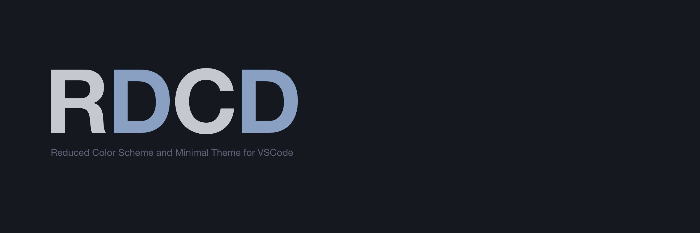
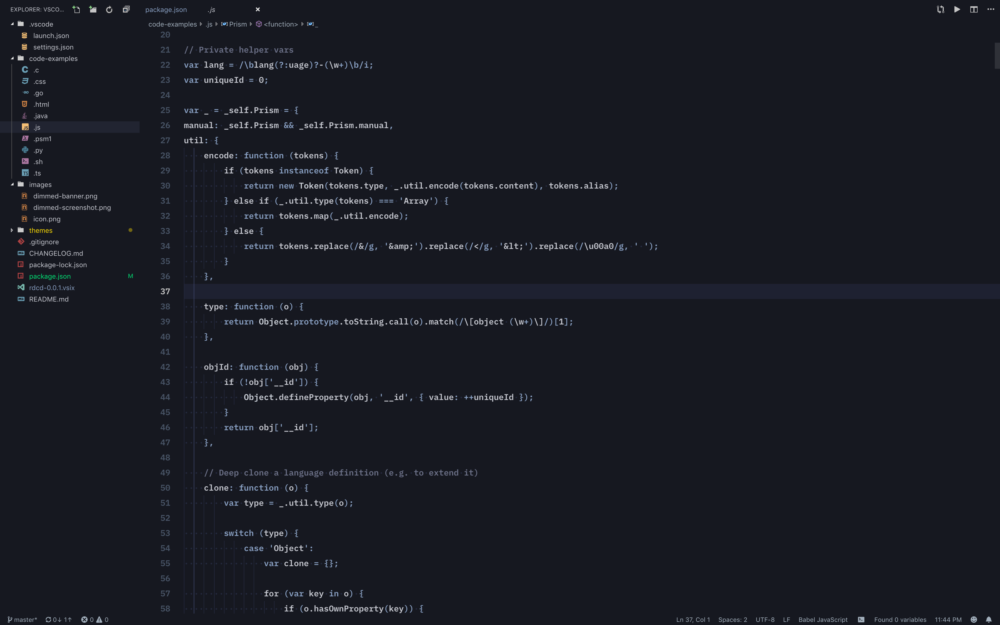

#

RDCD theme is a reduced color scheme for syntax highlighting and minimal theme for VSCode

## Why to reduce color usage

Some elements of the code that can add visual noise are using only one color with lower luminosity than context meaningful parts because additional colors add additional cognitive work to process. With RDCD syntax, just two colors are used + one additional color for comments and unused instances.

All signals (errors, modifications, alerts, etc.) are using colors with intensive luminosity to make it easily visible.

## Features

* Decreasing cognitive load by minimizing colors usage to highlight a code syntax

* Additional distractions minimization with minimal theme

* Contrast and eye-friendly. All colors tested by a Contrast Ratio and at least have value AA.

* Supported: Javascript, Typescript, HTML, CSS, Go, C, C++, Java, Python (probably some other languages as well)

## Some Characteristics

### Main colors used for syntax highlighting

**Primary syntax color:** #c6c8d0

**Background:** #161820

**WCAG 2.0 Contrast Ratio:** AAA

**Luminosity Contrast Ratio:** 10.61:1

**Secondary syntax color:** #89a0c3

**Background:** #161820

**WCAG 2.0 Contrast Ratio:** AA

**Luminosity Contrast Ratio:** 6.65:1

**Luminosity Contrast Ratio greater than 7:1 for AAA, 4.5:1 for AA**

### Inspiration

Inspired by [cocopon – iceberg.vim](https://github.com/cocopon/iceberg.vim)
